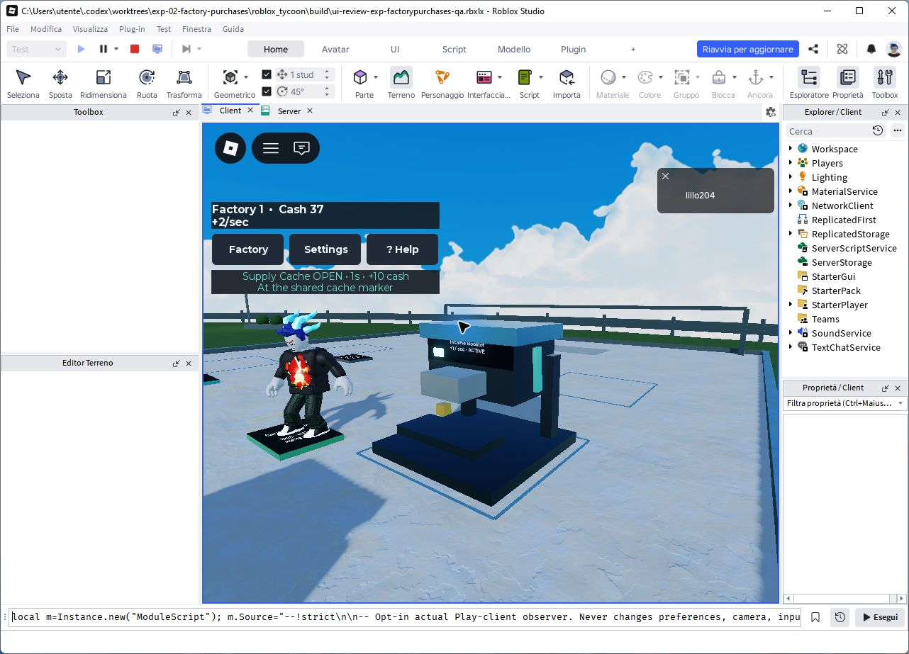

# EXP-02 factory purchase review

Status: **Revise pending founder feel review; draft only.** The walk-on loop is
reusable and the persistent machines communicate growth. Satisfaction, audible
feedback quality and readability on physical mobile hardware need play review.
This experiment does not establish strategic production depth.

## Open and play

From this branch, with the pinned Rokit tools on PATH:

```powershell
./scripts/New-ExperimentPlace.ps1 -Name FactoryPurchases
```

Open `build/ui-review-exp-factorypurchases.rbxlx` in Studio and press F5. The
starter unit earns one cash per second. Walk onto your Income Booster pad after
earning ten cash: it buys automatically, adds one cash per second, assembles for
0.55 seconds and remains visibly active. The original catalogue, prices,
prerequisites and income calculation are unchanged. Neighbors see replicated
equipment; rotor/output motion is local decoration. Supply Cache keeps its native
prompt. Settings offers reduced motion. Stop Play to reset and repeat.

An unaffordable, locked, blocked or expired entry requires leaving and re-entering.
Standing while cash accumulates or closing a panel never triggers a deferred buy.
Factory/Settings/Help panels, the Roblox menu, disabled prompts or lost window
focus suppress the client's entry reply. This protects ordinary UI use; the
server independently validates the live player, ownership, current proximity,
prerequisites, money and a one-use visit. It does not trust client money or pad IDs.

The [Sell Lemons listing](https://www.roblox.com/games/79268393072444/Sell-Lemons)
was checked as the brief's reference. Its gameplay was not independently played;
the walk-on preference comes from the user's confirmed direction.

## Ownership and tuning

Normal bootstraps retain native purchase prompts. Only the generated disposable
preview calls `TycoonRuntime.start({walkOn = true})` and `Hud.startWalkOn()`.
The shared purchase callback preserves the existing server checks. Regenerate
the preview after edits; do not sync the normal bootstraps over it.

`Experiments/FactoryPurchases/Rules.luau` owns 20 Hz root-center sampling, oriented
pad geometry (0.1-stud entry margin, 0.6-stud exit hysteresis, vertical -0.5..6),
0.75-second offer expiry, 0.55-second assembly, 140-stud activity distance and
30 Hz cosmetic updates. Visits belong to a character generation and one owner;
replays, other players, dead/replaced characters and expired visits cannot buy.

`WalkOn` and `Visits` own triggering; client `Controller` owns UI gates and the
quiet Roblox-bundled `rbxasset://sounds/volume_slider.ogg` purchase tone.
`Activity` owns three anchored, noncolliding, nontouching, nonquery parts per
machine. Construction moves only noncolliders; original colliders never move.
Output is simulated, never cash production. Empty factories say awaiting owner
and hide output. Reduced motion settles construction and freezes motion while
retaining benefit text and the ownership light. No external audio upload or asset
pipeline is required.

## Executed evidence

Studio 0.741.19.7411056, 8 October 2026, disposable solo client/server:

- 38 domain assertions: one-use/owner/character/expiry validation, original
  Session price/rate/duplicate behavior, unaffordable stay, exit hysteresis,
  every UI gate, rotated pads and a 16-stud/sec sampled traversal.
- 13 live assertions: a position fixture seeds the avatar outside its pad;
  **actual Humanoid walking** then enters while unfunded, stays through ordinary
  income, exits and re-enters. The unchanged production offer/reply/purchase
  route deducts exactly ten once, changes rate 1 to 2 and replicates the machine.
  Staying another three seconds produces no second charge. Final run completed
  at 21:13:17.680 UTC. This is engine integration, not native held-W/touch input.
- 36 read-only client assertions per motion mode: seven machines, three safe
  decorations each, correct owned/empty output visibility and moving/frozen
  purchased output. Reduced motion was changed using the actual Settings button.
  Each observer sampled 180 rendered frames; final normal p95/max were
  18.10/18.84 ms; reduced motion p95/max were 18.03/20.60 ms at 21:14:24.529 UTC.
  These are local desktop frame samples, not a mobile benchmark.
- Full `./scripts/Validate-Project.ps1`: formatting, Selene, type analysis, Rojo
  build and the repository's scene/source/preview regressions. Generated normal
  and QA variants contain exact modules, two opt-in bootstraps, and QA fixtures
  only in the QA variant. Canonical scene SHA256 stayed
  `9D6A9FE65A25E0C1D8CF6FA4FE7D4E582EA234FF618DC758BC71FD4675C9F8E8`.

For repeatable integration, generate with `-WithTests` and F5. Its optional
`FactoryPurchasesLive.spec.luau` walks the first test avatar; the ordinary review
copy never does. `FactoryPurchasesPresentation.spec.luau` is an opt-in Play-client
observer: run with `false`, toggle Settings reduced motion, run with `true`.
It does not write preferences, input, camera, cash or effects.



The screenshot uses a camera-framing fixture only, after the actual live purchase.
Earlier `after-auto-purchase.png` records ordinary camera/HUD feedback before the
final empty-lot and label refinements; it is not final presentation evidence.

## Review still needed

Native held keyboard movement, touch/controller traversal, buying behind an open
panel in a live session, simultaneous neighboring purchases, internet latency and
audio quality remain unobserved. Gate decisions are tested as domain inputs;
that does not substitute for every hardware/UI interaction. Seven machines were
measured locally; six fully upgraded owners (up to 30 machines/90 decorations)
and physical mobile performance were not measured. Distance culling and one
30 Hz loop bound activity, but do not establish that larger-scene frame budget.

Founder review should judge whether entering a pad is predictable, whether a new
machine and its benefit remain readable, whether the short assembly/tone feel
rewarding, and whether neighboring activity is useful without distraction. Keep
the interaction/presentation seams; revise visual scale, activity or timing from
that evidence before promoting the draft.
