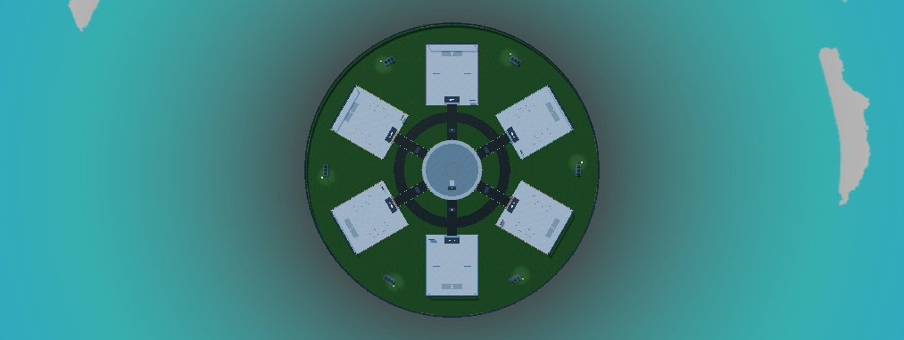
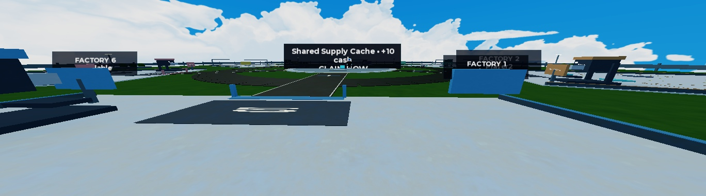
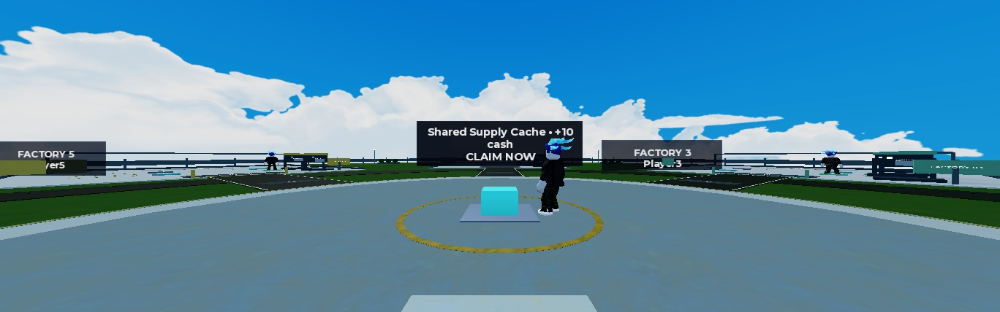
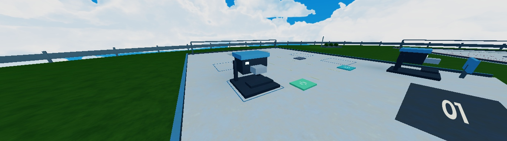
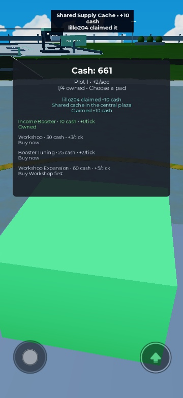
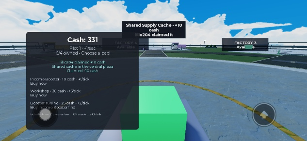

# MAP-01 review checkpoint

Six equal inward-facing factories share a walkable central plaza. This checkpoint
requires visual founder review before merge. The economy, four catalogue entries,
Supply Cache schedule/reward and FIX-01 ordering behavior remain unchanged.

## Dimensions and ownership

| Element | Final dimensions |
| --- | --- |
| Lots | Six, 60×70 studs, 60° spacing |
| Lot-center ring | Radius 110 studs |
| Plaza | Diameter 70 studs |
| Spokes / circulation | 12 studs wide; circulation center radius 61 |
| Ground / visible border | Diameter 340 / rail radius 168 |
| Entrance / center | 75 studs |
| Minimum usable lot gap | 23.0385 studs between actual oriented foundations |
| Normal entrance-to-center approach | 4.75, 4.85, 4.83, 4.90, 4.73, 4.75 seconds (lots 1–6) |

Walking times use equivalent entrances to a 4-stud radial cache approach at the
normal 16-stud/sec speed, with the navigation controller's approximately one-stud
arrival tolerance. Heartbeat sampling observed gradual movement (maximum sampled
step about 0.4 studs). No teleport substituted for traversal. Curbs/markings stay
within lot footprints; planters/lamps are outside the lots and circulation.
Symmetry and these observations do not establish network or gameplay fairness.

The saved scene owns foundations, ground, plaza, paths, border, landscaping,
numbers, oriented anchors/pivots and one neutral spawn 15 studs from the cache.
Runtime owns signs, initial/purchased equipment, pads, cache and HUD. The current
map has 695 descendants (698 in Workspace in Edit); six owners with one purchased
booster each produced 264 runtime descendants. These counts are observations,
not a mobile performance benchmark.

## Scene replacement and recovery

Starting main: 29ee28cfad8f8d3abaf905962723945257886f54.
Original SHA256:
E68D11363B1C2BF10EF37C12EA566F6E8839940F07579BDCE9DBE57FB38C4B49.
It remains recoverable at that commit's place/tycoon.rbxlx and in the verified
local build/original-tycoon.rbxlx backup in the task worktree.

Removed: old mountains/terrain, architecture/foliage/VFX/material scene folders,
ball/platform/targets, reset bounds, template remotes/modules and reset/target/
runtime-insertion scripts. No template physics or obsolete terrain remains under
the hub. Retained: service/place settings and sky; lighting effects were reduced
to avoid fog/depth blur hiding rival factories. No Toolbox assets/scripts added.

Current canonical SHA256:
9D6A9FE65A25E0C1D8CF6FA4FE7D4E582EA234FF618DC758BC71FD4675C9F8E8.
See README.md here for native Studio serialization provenance and map contract.
Current code is captured in the scene, but Git/Rojo remains its authority.

## Automated and observed evidence

- Complete Validate-Project.ps1: formatting, lint, build/sourcemap, type analysis,
  existing structure/type failure probes, saved-map contract and seven malformed
  scene probes. Optional authoring CheckSnapshotCode verifies all mapped copies.
- Actual modules in Studio: Session 186, SupplyEvent 196, SupplyFeedback 65 and
  MapLayout 522 assertions, including six owners/seventh refusal and saved layout
  support, facing, footprint intersection, obstacle, reset and rotated equipment.
- Solo: all six entrance/production-zone walks, connected neighboring-lot route,
  all four normal prompt purchases, rate 12 and no health loss.
- Earlier real six-client session: unique lots, live independent income, six normal
  booster purchases, six exact -10 deductions, own-lot replicated equipment.
- Focused two-client session: funded non-owner rejection; Workshop -30 once,
  replay rejected without neighbor effects; competing normal claims produced
  one exact +10, matching public winner and requester-only private feedback.
- Real respawn retained assignment/purchases and same HUD; real disconnect
  released only its lot; AddPlayers replacement reused it with fresh progression.
- iPhone 17 Pro emulation: portrait safe-area measurements and native Touch
  purchase/claim on the unchanged centered portrait branch; final-source
  landscape Touch claim after moving the wide HUD away from the center prompt.
  No physical phone or mobile performance claim.
- Task-owned Studio stop leaves the 698-descendant Edit scene, no runtime/events
  or QA modules. Device preferences are restored to default, LandscapeRight,
  ScaleToPhysicalSize. An orientation switch during Play sometimes stalled MCP
  capture. The final-source portrait repeat remains pending as described below.

The committed behavior-bearing tree is
7f4478b3635b53d9471b5dd52db15bc613677a9a, based on main 29ee28c above.
A separate clean detached clone under build/restore-checkout reopened its tracked
scene in Studio, with matching SHA256, all 695 hub descendants/698 Workspace
descendants and pivots present in Edit. All 14 script classes and normalized
sources matched that checkout and were applied from it. The four actual module
tests passed again (969 assertions). A fresh real six-client session on this
commit gave six unique owners with independent live income.

The earlier six-client purchase/lifecycle and two-client competition observations
precede the final presentation adjustments (smaller billboards, wide HUD position)
and a type-only local variable in the rectangle corner calculation. Map geometry,
purchase placement and economy were unchanged. A repeat of normal six-client
purchases and final portrait/restore prompt smoke is still required: the fresh
shell-launched clients report a 1×1 camera viewport, do not show normal prompts,
and MCP capture stalls. Native device switching did not restore rendering. No
purchase was recorded as successful in that repeat; all six remained at rate 1.
The test was stopped, preferences restored, and the committed file stayed clean.
The PR records final-head CI separately from these Studio observations.

## Actual Studio captures

World shots from the earlier live session temporarily hide the HUD. Factory-eye uses the normal first-person
Custom camera; close-up uses a temporary capture camera. The images are actual
Studio renders, with no generated concept art.

## Preview and remaining decision

Task checkout:
C:/Users/leona/Documents/GitHub/roblox_tycoon-worktrees/map-01.
Open place/tycoon.rbxlx there in Studio. The complete base is visible in Edit;
Play runs the captured current code. For later code edits, serve that checkout's
default.project.json and connect its three code folders through Rojo.

Retain the draft task worktree and verified original backup for review. Earlier
policy-blocked leftovers and the unrelated Studio session are untouched.

Review scale/spacing, whether the starter equipment plus unused expansion floor
feels like a factory, and whether neighbors/opposite growth remain visible while
walking. Report approve or the specific adjustment wanted. This is the required
founder decision before merge; it is not a compiler-panel test request.

To unblock the remaining automated Studio repeat, open this checkout's
place/tycoon.rbxlx in a normal visible Studio window with MCP enabled and report
connected. Codex can then repeat normal prompts and final phone portrait through
the supported Studio interface. The draft remains open for that evidence and
the visual founder decision. No desktop control or repeated compiler QA is needed.

Production supports six owners. Local Players.MaxPlayers still reads 60 and is
read-only to scripts. Before publishing, configure the intended hosted place
maximum to six in supported place settings; no publishing/live access changes
were made, and no seventh-player kick was added.
